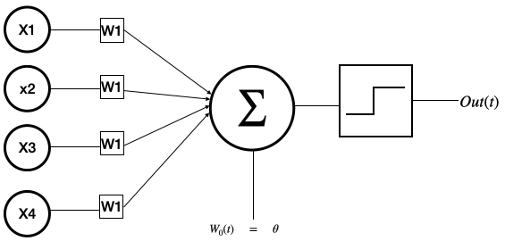
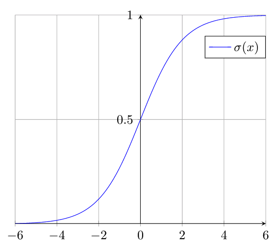

## Perceptron

Most of the best-performing artifical-intelligence systems - such as **self driving cars, voice search & voice-activated assistants, automatic machine translation, image recoginition** were possible because of deep learning. Deep learning is a branch artifical intelligence powered by neural networks.
Neural Networks are a means of doing machine learning, in which a computer learns to perform some task by analyzing training examples. The first trainable neural network, **the Perceptron**, was demonstrated by the Cornell University psychologist Frank Rosenblatt in 1957. The Perceptron’s design was much like that of the modern neural net, except that it had only **one layer with adjustable weights and thresholds, sandwiched between input and output layers**. It's worth understanding how simple perceptron looks like and how they work? <br/> A perceptron takes several binary inputs **${ x }_{ 1 }, { x }_{ 2 }, { x }_{ 3 }, { x }_{ 4 }$..,** and produces a single binary output. <br />



In the above example the perceptron has four inputs,
${ x }_{ 1 }, { x }_{ 2 }, { x }_{ 3 }, { x }_{ 4 }$. The perceptron stores some more numbers called _weights_, ${ w }_{ 1 }, { w }_{ 2 }, { w }_{ 3 }, { w }_{ 4 }$, real numbers to expressing the importance of the respective inputs to the ouput. The perceptrons output is determined by the **weighted sum** $\sum { { x }_{ i }{ w }_{ i } }$ fed to an **activation function**. The activation function results in output, 0 or 1, based on the threshold.<br></br>
The algebraic notation will look like:

> $$output=\left\{ \begin{array}{ll} 0 & \sum { { w }_{ i }x_{ i } } \quad <\quad threshold \\  &  \\ 1 & \sum { { w }_{ i }x_{ i } } \quad >\quad threshold \end{array} \right.$$

### Implementation

Let's write a simple code for above perceptron using python, we will built everything from scratch without using any packages, the mathematics looks pretty simple we calculate loss for each input and update weights accordingly.

```
from random import random

class Perceptron(object):
    def __init__(self, x_train, y_train, epochs=1000, learn_rate= 0.1):
        self.accuracy = 0
        self.samples = 0
        self.x_train = x_train
        self.y_train = y_train

        self.epochs = epochs
        self.learn_rate = learn_rate

        self.bias = 0
        self.weights = [random() for _ in range(len(x_train[0]))]

    # returns percent accuracy
    def current_accuracy(self):
        return self.accuracy / self.samples

    # activation function
    def activation(self, n):
        return 0 if n < 2 else 1

    def predict(self,ip):
        total = self.bias
        for i,j in enumerate(self.weights):
            total += ip[i] * j
        return self.activation(total)

    def fit(self):
        for e in range(self.epochs):
            print('#### Running for #### Epoch: ' + str(e))
            for i in range(len(self.x_train)):
                prediction = self.predict(self.x_train[i])
                print('Expected:'+ str(self.y_train[i]) + 'Model Output:' + str(prediction))
                if self.y_train[i] == prediction:
                    self.accuracy += 1
                else:
                    self.accuracy -= 1
                self.samples += 1
                loss = self.y_train[i] - prediction

                for w in range(len(self.weights)):
                    self.weights[w] += loss * self.x_train[i][w] * self.learn_rate

                self.bias += loss * self.learn_rate
            print('Epoch: %s: Accuracy: %s ' % (str(e), str(self.current_accuracy())))


x = [[1, 1, 1], [0, 0, 0], [1, 0, 1]]
y = [1, 0, 0]
perceptron = Perceptron(x, y, epochs=1000, learn_rate=0.1)
perceptron.fit()
```

### Applications

The above perceptron model can be used to design any **logic gate** based on how you train your model. Based on our training data and activation threshold of 2, the perceptron will behave as **logic AND gate**

```
>>> perceptron.predict([0, 1, 0])
0
>>> perceptron.predict([1, 1, 1])
1
```

##### Table: Perceptron implementing AND gate with Threshold of 2

| Input 0 | Input 1 | Input 2 | Threshold | Output |
| ------- | ------- | ------- | --------- | ------ |
| 0       | 0       | 0       | 2         | 0      |
| 1       | 0       | 1       | 2         | 0      |
| 1       | 1       | 1       | 2         | 1      |

## Combining perceptrons

Perceptron isn't a complete model of human decision-making!. The perceptron can be chained together; the output of a perceptron can be used as the input to another perceptron. A standard neural network consists of many simple, **connected processors called perceptrons,** each producing a sequence of real-valued activations.<br></br>


**Input neurons** get activated through sensors perceiving the environment, **other neurons(hidden layer neurons)** get activated through weighted connections from previously active neurons.<br></br>
Let's simplify our perceptron model. The first change is to write $\sum { { x }_{ i }{ w }_{ i } }$ as a **dot product**, $w.x =\sum { { w }_{ i } } x_{ i }$, where $\ { { w }\ and \ { x } }$ are input and weights vectors. we will also use bias instead of threshold, the modified equation will look like

> $$output=\left\{ \begin{array}{ll} 0 &  { { w }.{ x }+{b} } \quad \le 0 \\  &  \\ 1 &  { { w }.{ x }+{b} } \quad > 0 \end{array} \right.$$

## Learning

Perceptrons are good at separating an input space into two parts (the output). Training a perceptron amounts to adjusting the **weights and biases** such that it rotates and shifts a line until the input space is properly partitioned. The perceptron had a step function to map inputs to (binary) outputs, which means a small change in weight can result an entirely differrent output. <br></br>A real neuron either fires an action potential or not (i.e., generates a 1 or 0), the response of a neuron is often described by its firing rate (i.e., the number of spikes per unit time), resulting in a graded response (Adrian and Matthews, 1927). To model these responses, we will use a different neural network model, called a linear network made of neurons. Neurons are similar to perceptrons, modified so that small change in their wieghts and biases results a small change in their output.

## Neuron

A **neuron** is like a perceptron and has inputs ${ x }_{ 1 }, { x }_{ 2 }, { x }_{ 3 }...$, the inputs can take any **values between 0 and 1** like 0.345 and also have weights ${ w }_{ 1 }, { w }_{ 2 }, { w }_{ 3 }....$.<br></br>
<br></br>
The output can be any value between 0 and 1 given by $\sigma (x.w+b)$, where $\sigma$ is called the **_sigmoid function_** i,e activation function for neuron. The sigmoid function is given by

> $$\sigma (z)=\frac { 1 }{ 1+{ e }^{ -z } }$$

The sigmoid function is a **_squashing function_**, limit the output to a range between 0 and 1, making these functions useful in the prediction of probabilities.
<br></br>
Let's try to understand above 3-input neuron with simple example. Assume we have below parameters for the neuron and sigmoid as activation function.

> $$w^{(1)}=\left[ \begin{matrix} { w }_{ 11 }^{ (1) }\quad { w }_{ 12 }^{ (1) }\quad { w }_{ 13 }^{ (1) } \\ { w }_{ 21 }^{ (1) }\quad { w }_{ 22 }^{ (1) }\quad { w }_{ 3 }^{ (1) } \end{matrix} \right] $$

For input $x=\left[ \begin{matrix} 3 & 5 \\ 5 & 1 \\ 10 & 2 \end{matrix} \right]$, the output is a dot product of input and weight vectors.

> $x.w=\left[ \begin{matrix} 3*{ w }_{ 11 }^{ (1) }+5*{ w }_{ 21 }^{ (1) } & 3*{ w }_{ 12 }^{ (1) }+5*{ w }_{ 22 }^{ (1) } & 3*{ w }_{ 13 }^{ (1) }+5*{ w }_{ 23 }^{ (1) } \\ 5*{ w }_{ 11 }^{ (1) }+1*{ w }_{ 21 }^{ (1) } & 5*{ w }_{ 12 }^{ (1) }+1*{ w }_{ 22 }^{ (1) } & 5*{ w }_{ 13 }^{ (1) }+1*{ w }_{ 23 }^{ (1) } \\ 10*{ w }_{ 11 }^{ (1) }+2*{ w }_{ 21 }^{ (1) } & 10*{ w }_{ 21 }^{ (1) }+2*{ w }_{ 22 }^{ (1) } & 10*{ w }_{ 13 }^{ (1) }+2*{ w }_{ 23 }^{ (1) } \end{matrix} \right] $

> ${ z }^{ (2) }=\left[ \begin{matrix} { z }_{ 11 }^{ (2) } & { z }_{ 12 }^{ (2) } & { z }_{ 13 }^{ (2) } \\ { z }_{ 21 }^{ (2) } & { z }_{ 22 }^{ (2) } & { z }_{ 23 }^{ (2) } \\ { z }_{ 31 }^{ (2) } & { z }_{ 32 }^{ (2) } & { z }_{ 33 }^{ (2) } \end{matrix} \right] $

> ${ z }^{ (2) }= X {W}^{(1)} { \qquad\qquad\qquad (1) }$

> ${ a }^{ (2) }= \sigma({ z }^{ (2) }) { \qquad\qquad\qquad (2) }$

> ${ z }^{ (3) }= { a }^{ (2) }{ w }^{ (2) } { \qquad\qquad\qquad (3) }$

> $ \overset { \wedge  }{ y }  = \sigma({ z }^{ (3) }) { \qquad\qquad\qquad\quad (4) }$

Where, ${ w }^{ (2) }=\left[ \begin{matrix} { w }_{ 11 }^{ (2) } \\ { w }_{ 21 }^{ (2) } \\ { w }_{ 31 }^{ (2) } \end{matrix} \right] $

## Coding implemenatation of neuron

```

import numpy as np

class Neuron(object):
    def __init__(self, inputLayerSize, outputLayerSize, hiddenLayerSize):
        self.inputLayerSize = inputLayerSize
        self.outputLayerSize = outputLayerSize
        self.hiddenLayerSize = hiddenLayerSize
        self.w1 = np.random.randn(self.inputLayerSize, self.hiddenLayerSize)
        self.w2 = np.random.randn(self.hiddenLayerSize, self.outputLayerSize)

    @staticmethod
    def sigmoid(z):
        return 1.0 / (1.0 + np.exp(-z))

    def feedforward(self, X):
        self.z2 = np.dot(X.self.w1)
        self.a2 = Neuron.sigmoid(self.z2)
        self.z3 = np.dot(self.a2, self.w2)
        output = Neuron.sigmoid(self.z3)
        return output
```

#### Output

```
>> nn = Neuron(2, 1, 3)
>> X=np.array([[3,5],[5,1],[10,2]])
>> nn.feedforward(X)
array([[0.6378171 ],
       [0.53690663],
       [0.55179034]])
```

The estimates are utter trash, this is because we have not trained our network. In next step we will train our network.

## Training

To improve our model, we need to quantify how wrong our prediction are, we do this with a **cost function**.

> ### _Training a Network = Minimizing a Cost Function_

### Cost Function

To quantify how well we're able to find weights and biases to approximate ouput we define a **_cost function_**.<br></br>
Let's use **_mean square error(MSE)_** as our cost function

> $MSE=\frac { 1 }{ 2n } \sum _{ i=1 }^{ n }{ ({ y }_{ actual } - \overset { \wedge  }{ y })^{ 2 } }{ \qquad\qquad\qquad\qquad\qquad\qquad (5) } $ <br></br>

Substituting values of equations $(1),(2),(3),(4)$ in equation (5)

> $J=\frac { 1 }{ 2n } \sum _{ i=1 }^{ n }{ ({ y }_{ actual } - \sigma(\sigma({X}{W}^{(1)}){W}^{(2)})})^{2}{ \qquad\qquad\qquad\quad (6) } $ <br></br>

With the help of **calculus** we can easily know which way is downhill. if $\frac { \partial J }{ \partial x } = +ve\quad$The cost function is going uphill and vice versa. The reason we choose **cost function** to be the sum of square errors is to avoid non-convex nature of function.

The **cost function** is a function of ${w}$ and ${b}$. Since we have less control over input data, so we will minimize our cost by adjusting the weights. The **cost function** becomes small, i.e. $C({w},{b})\simeq {0}$ when ${ y }_{ actual }$ is approximately equal to ${ y }_{ predict }$ we can write it as:

> $MSE=C({w},{b})$

```
    def cost(self, X, y):
        self.yHat = self.feedforward(X)
        J = 0.5 * sum((y - self.yHat) ** 2)
        return J
```

- ${n}$ is the total number of observations.
- $\frac { 1 }{ 2n } \sum _{ i=1 }^{ n }$ is the mean.
  <br></br>
  By **training** we aim to minimize cost function $C({w},{b})$. In other words, we are trying to find the best possible values of **weights** and **biases** which makes the cost function as small as possible. we will be using **gradient descent algorithm** for this. In **Gradient Descent or Batch Gradient Descent**, we use the whole training data per **epoch** whereas, in **Stochastic Gradient Descent**, we use only single training example per **epoch** and **Mini-batch Gradient Descent** lies in between of these two extremes, in which we can use a **mini-batch(small portion)** of **training data per epoch**, thumb rule for selecting the size of mini-batch is in power of **2 like 32, 64, 128** etc For details, Check [gradient descent](href="https://cs231n.github.io/optimization-1/#gd). Let's plot C as a function of one variable(${w}_{(1)}$), the graph looks like

<iframe width="100%" height="600" frameborder="1" scrolling="no" src="https://plotly.com/~Aarif1430/5/"></iframe>

<iframe width="100%" height="600" frameborder="1" scrolling="no" src="//plotly.com/~Aarif1430/3.embed"></iframe>

_The graph is interactive use graph controls to have closer view of the cost function_.<br></br>
To perform **gradient descent**, $\frac { \partial J }{ \partial w } = ?$. We will use our two weight matrices $w^{(1)}$ and $w^{(2)}$

> $$w^{ (1) }=\left[ \begin{matrix} { w }_{ 11 }^{ (1) }\quad { w }_{ 12 }^{ (1) }\quad { w }_{ 13 }^{ (1) } \\ { w }_{ 21 }^{ (1) }\quad { w }_{ 22 }^{ (1) }\quad { w }_{ 23 }^{ (1) } \end{matrix} \right] \qquad \qquad \rightarrow \qquad \frac { \partial J }{ \partial w^{ (1) } } =\left[ \begin{matrix} \frac { \partial J }{ \partial { w_{ 11 } }^{ (1) } } \quad \frac { \partial J }{ \partial { w_{ 12 } }^{ (1) } } \quad \frac { \partial J }{ \partial { w_{ 13 } }^{ (1) } }  \\ \frac { \partial J }{ \partial { w_{ 21 } }^{ (1) } } \quad \frac { \partial J }{ \partial { w_{ 22 } }^{ (1) } } \quad \frac { \partial J }{ \partial { w_{ 23 } }^{ (1) } }  \end{matrix} \right] $$ <br></br>

> $$w^{ (2) }=\left[ \begin{matrix} { w }_{ 12 }^{ (2) } \\ { w }_{ 21 }^{ (2) } \\ { w }_{ 13 }^{ (2) } \end{matrix} \right] \qquad \qquad \quad \rightarrow \qquad \qquad \frac { \partial J }{ \partial w^{ (2) } } =\left[ \begin{matrix} \frac { \partial J }{ \partial { w_{ 11 } }^{ (2) } } \quad  \\ \frac { \partial J }{ \partial { w_{ 21 } }^{ (2) } } \quad  \\ \frac { \partial J }{ \partial { w_{ 31 } }^{ (2) } } \quad  \end{matrix} \right] $$

Let's compute $\frac { \partial J }{ \partial { w }^{ (2) } }$ first.

> $\frac { \partial J }{ \partial { w }^{ (2) } }= \frac {\partial (\frac { 1 }{ 2n } \sum _{ i=1 }^{ n }{ ({ y }_{ actual } - \overset { \wedge  }{ y })^{ 2 } })} { \partial { w }^{ (2) } }$ <br></br>

Since differentation is distributive over summation, therefore

> $\frac { \partial J }{ \partial { w }^{ (2) } } =\sum _{ i=1 }^{ n } \frac { \partial (\frac { 1 }{ 2n } { ({ y }_{ actual }-\overset { \wedge  }{ y })^{ 2 } }) }{ \partial { w }^{ (2) } }$

We will compute dervative of single term

> $\frac { \partial J }{ \partial { w }^{ (2) } } = \frac { \partial (\frac { 1 }{ 2 } { ({ y }_{ actual }-\overset { \wedge  }{ y })^{ 2 } }) }{ \partial { w }^{ (2) } } = { \frac { 1 }{ 2 } (2) ({{y}_{actual} - \overset { \wedge  }{ y } })({ (\frac{\partial{ y }_{ actual }}{ \partial { w }^{2} })-(\frac {\partial\overset { \wedge  }{ y }) } { \partial { w }^{2} }} ))}$

${y}_{actual}$ is our test score and wouldn't change with respect to ${w}$. Therefore, $\frac { \partial { y }_{ actual } }{ \partial { w }^{ 2 } } = 0$ and

> $\frac { \partial J }{ \partial { w }^{ (2) } } ={ -({ y }_{ actual }-\overset { \wedge  }{ y }){ (\frac { \partial \overset { \wedge  }{ y } }{ \partial { w }^{ (2) } } ) } }
 \qquad\qquad\qquad(7)$

From **equation-4**; $ \overset { \wedge  }{ y }$ _is a function of_ ${ z }^{ (3) }$. From chain rule of differentiation

> $\frac { \partial \overset { \wedge  }{ y } }{ \partial { w }^{ (2) } } = \frac { \partial \overset { \wedge  }{ y } }{ \partial { z }^{ (3) } } * \frac { \partial { z }^{(3)} }{ \partial { w }^{ (2) } }$

The **equation-7** becomes

> $\frac { \partial J }{ \partial { w }^{ (2) } } ={ -({ y }_{ actual }-\overset { \wedge  }{ y })(\frac { \partial \overset { \wedge  }{ y } }{ \partial { z }^{ (3) } } * \frac { \partial { z }^{(3)} }{ \partial { w }^{ (2) } }) }
 \qquad\qquad\quad(8)$

Again, from **equation-4**; $ \overset { \wedge  }{ y }  = \sigma({ z }^{ (3) })$

> $\frac { \partial \overset { \wedge  }{ y } }{ \partial { z }^{ (3) }} = \frac { \partial (\sigma({ z }^{ (3) }) )}{ \partial { z }^{ (3) }}={ f }^{ \prime  }({ z }^{ (3) })=\frac {{e}^{{(-z)}^{(3)}}}{{(1+{e}^{(-z)})}^{2}}$

Now, we will add another method **derivative of a sigmoid function** to a Neuron class.

```
def sigmoidPrime(z):
    return np.exp(-z)/((1+np.exp(-z))**2)

```

Plotting **sigmoid and sigmoidPrime** for a random array

<iframe width="100%" height="600" frameborder="1" scrolling="no" src="//plotly.com/~Aarif1430/7.embed"></iframe>

Therefore, **equation-8** becomes

> $\frac { \partial J }{ \partial { w }^{ (2) } } ={ -({ y }_{ actual }-\overset { \wedge  }{ y })( { f }^{ \prime  }({ z }^{ (3) })* (\frac { \partial { z }^{(3)} }{ \partial { w }^{ (2) } }) }
 \qquad\qquad\qquad(9)$

$\frac { \partial { z }^{(3)} }{ \partial { w }^{ (2) } }$ represents the change in **third layer activity w.r.t second layer weights**. From **equation-3** ${ z }^{ (3) }= { a }^{ (2) }{ w }^{ (2) }$. Therefore

> $\frac { \partial { z }^{(3)} }{ \partial { w }^{ (2) } } = \left[ \begin{matrix} { { a }_{ 11 }^{ (2) } } & { { a }_{ 12 }^{ (2) } } & { { a }_{ 13 }^{ (2) } } \\ { { a }_{ 21 }^{ (2) } } & { { a }_{ 22 }^{ (2) } } & { { a }_{ 23 }^{ (2) } } \\ { { a }_{ 31 }^{ (2) } } & { { a }_{ 32 }^{ (2) } } & { { a }_{ 33 }^{ (2) } } \end{matrix} \right] $

Let's try to simplify **equation-9**

> $\frac { \partial J }{ \partial { w }^{ (2) } } = -\left[ \begin{matrix} { y }_{ 1 }-\overset { \wedge  }{ { y }_{ 1 } }  \\ { y }_{ 2 }-\overset { \wedge  }{ { y }_{ 2 } }  \\ { y }_{ 3 }-\overset { \wedge  }{ { y }_{ 3 } }  \end{matrix} \right] * \left[ \begin{matrix} f^{ ' }({ { z }_{ 1 } }^{ (3) }) \\ f^{ ' }({ { z }_{ 2 } }^{ (3) }) \\ f^{ ' }({ { z }_{ 3 } }^{ (3) }) \end{matrix} \right] * \left[ \begin{matrix} { { a }_{ 11 }^{ (2) } } & { { a }_{ 12 }^{ (2) } } & { { a }_{ 13 }^{ (2) } } \\ { { a }_{ 21 }^{ (2) } } & { { a }_{ 22 }^{ (2) } } & { { a }_{ 23 }^{ (2) } } \\ { { a }_{ 31 }^{ (2) } } & { { a }_{ 32 }^{ (2) } } & { { a }_{ 33 }^{ (2) } } \end{matrix} \right] \qquad\qquad(10)$

we wil computer scalar product of first two matrices.

> $\left[ \begin{matrix} { y }_{ 1 }-\overset { \wedge  }{ { y }_{ 1 } }  \\ { y }_{ 2 }-\overset { \wedge  }{ { y }_{ 2 } }  \\ { y }_{ 3 }-\overset { \wedge  }{ { y }_{ 3 } }  \end{matrix} \right] * \left[ \begin{matrix} f^{ ' }({ { z }_{ 1 } }^{ (3) }) \\ f^{ ' }({ { z }_{ 2 } }^{ (3) }) \\ f^{ ' }({ { z }_{ 3 } }^{ (3) }) \end{matrix} \right] = \left[ \begin{matrix} { \delta  }_{ 1 }^{ (3) } \\ { \delta  }_{ 2 }^{ (3) } \\ { \delta  }_{ 3 }^{ (3) } \end{matrix} \right] = {\delta}^{(3)}$

${\delta}^{(3)}$ is back propagating error. Therefore **equation-10** becomes

> $\frac { \partial J }{ \partial { w }^{ (2) } } = -\left[ \begin{matrix} { \delta  }_{ 1 }^{ (3) } \\ { \delta  }_{ 2 }^{ (3) } \\ { \delta  }_{ 3 }^{ (3) } \end{matrix} \right] * \left[ \begin{matrix} { { a }_{ 11 }^{ (2) } } & { { a }_{ 12 }^{ (2) } } & { { a }_{ 13 }^{ (2) } } \\ { { a }_{ 21 }^{ (2) } } & { { a }_{ 22 }^{ (2) } } & { { a }_{ 23 }^{ (2) } } \\ { { a }_{ 31 }^{ (2) } } & { { a }_{ 32 }^{ (2) } } & { { a }_{ 33 }^{ (2) } } \end{matrix} \right] $

Converting activation matrix to it's transpose and find the product with error matrix

> $\frac { \partial J }{ \partial { w }^{ (2) } } =-\left[ \begin{matrix} { { a }_{ 11 }^{ (2) } } & { { a }_{ 21 }^{ (2) } } & { { a }_{ 31 }^{ (2) } } \\ { { a }_{ 12 }^{ (2) } } & { { a }_{ 22 }^{ (2) } } & { { a }_{ 32 }^{ (2) } } \\ { { a }_{ 13 }^{ (2) } } & { { a }_{ 23 }^{ (2) } } & { { a }_{ 33 }^{ (2) } } \end{matrix} \right] *\left[ \begin{matrix} { \delta  }_{ 1 }^{ (3) } \\ { \delta  }_{ 2 }^{ (3) } \\ { \delta  }_{ 3 }^{ (3) } \end{matrix} \right]=-\left[ \begin{matrix} { a }_{ 11 }^{ (2) }{ \delta  }_{ 1 }^{ (3) }+{ a }_{ 21 }^{ (2) }{ \delta  }_{ 2 }^{ (3) }+{ a }_{ 31 }^{ (2) }{ \delta  }_{ 3 }^{ (3) } \\ { a }_{ 12 }^{ (2) }{ \delta  }_{ 1 }^{ (3) }+{ a }_{ 22 }^{ (2) }{ \delta  }_{ 2 }^{ (3) }+{ a }_{ 32 }^{ (2) }{ \delta  }_{ 3 }^{ (3) } \\ { a }_{ 13 }^{ (2) }{ \delta  }_{ 1 }^{ (3) }+{ a }_{ 23 }^{ (2) }{ \delta  }_{ 2 }^{ (3) }+{ a }_{ 33 }^{ (2) }{ \delta  }_{ 3 }^{ (3) } \end{matrix} \right] $

We now have final term $\frac { \partial J }{ \partial { w }^{ (1) } }$ to compute.
I am skipping most of the steps as the derivation for calculation of $\frac { \partial J }{ \partial { w }^{ (2) } }$ is same as $\frac { \partial J }{ \partial { w }^{ (1) } }$. Therefore the **equation-7** for dervative **w.r.t** ${w}^{(1)}$ becomes

> $\frac { \partial J }{ \partial { w }^{ (1) } } ={ -({ y }_{ actual }-\overset { \wedge  }{ y }){ (\frac { \partial \overset { \wedge  }{ y } }{ \partial { w }^{ (1) } } ) } }
 \qquad\qquad\qquad(11)$

> $ ={ -({ y }_{ actual }-\overset { \wedge  }{ y })( { f }^{ \prime  }({ z }^{ (3) })* (\frac { \partial { z }^{(3)} }{ \partial { w }^{ (1) } }) }\quad$

From **chain rule of differentiation** $\frac { \partial { z^{(3)} } }{ \partial { w }^{ (1) } }$ can be represented as

> $\frac { \partial { z^{(3)} } }{ \partial { w }^{ (1) } } = \frac { \partial { {z}^{(3)} } }{ \partial { a }^{ (2) } } * \frac { \partial { a }^{(2)} }{ \partial { w }^{ (1) } }$

Substituting values in **equation-11**

> $\frac { \partial J }{ \partial { w }^{ (1) } } ={ {\delta ^{(3)}} (\frac { \partial { {z}^{(3)} } }{ \partial { a }^{ (2) } } * \frac { \partial { a }^{(2)} }{ \partial { w }^{ (1) } })} \qquad\qquad\qquad(12)$

$\frac { \partial { {z}^{(3)} } }{ \partial { a }^{ (2) } }$ is the rate of change of ${z}^{(3)}$ **w.r.t** ${a}^{(2)}$ and there is **linear relation** between the two and can be represented as ${w}^{(2)}$. Therefore **equation-12** becomes

> $\frac { \partial J }{ \partial { w }^{ (1) } } ={ {\delta ^{(3)}} ({({w^{(2)})}^T} * \frac { \partial { a }^{(2)} }{ \partial { w }^{ (1) } })} \qquad\qquad\quad(13)$

Since ${a^{(2)}}$ **is function of** ${z^{(2)}}$. Therefore,

> $\frac { \partial { a }^{(2)} }{ \partial { w }^{ (1) } } = \frac { \partial { a }^{(2)} }{ \partial { z }^{ (2) } }* \frac { \partial { z }^{(2)} }{ \partial { w }^{ (1) } }  $

> $\frac { \partial { a }^{(2)} }{ \partial { z }^{ (2) } } = {f}^{\prime}({z_{(2)}})$

Substituting above value in **equation-13**

> $\frac { \partial J }{ \partial { w }^{ (1) } } ={ {\delta ^{(3)}} {({w^{(2)})}^T} * {f}^{\prime}({z_{(2)})}* \frac { \partial { z }^{(2)} }{ \partial { w }^{ (1) } }} \qquad\qquad(14)$

From **equation-1** ${z}^{(2)}$ is a function of input $X$ and ${w}^{(1)}$. Therefore, **equation-14** becomes

> $\frac { \partial J }{ \partial { w }^{ (1) } } ={ {X^{T}} {\delta ^{(3)}} {({w^{(2)})}^T} * {f}^{\prime}({z_{(2)})}} \qquad\qquad\quad(15)$

we will add one more method to our **Neuron class** to compute gardient i.e $\frac { \partial J }{ \partial { w }^{ (2) } }$ and $\frac { \partial J }{ \partial { w }^{ (1) } }$

```
    def cost_derivative(self, X, y):
        self.yHat = self.feedforward(X)
        delta3 = np.multiply(-(y-self.yHat), self.sigmoidPrime(self.z3))
        dJdW2 = np.dot(self.a2.T, delta3)
        delta2 = np.dot(delta3, self.w2.T)*self.sigmoidPrime(self.z2)
        dJdW1 = np.dot(X.T, delta2)
        return dJdW1,dJdW2
```

## Training with gradient descent

A **gradient descent** is an algorithm for finding the nearest **local minimum** of a function. The method of **steepest descent**, also called the gradient descent method, starts at a point $
{ P }_{ 0 }$ and, as many times as needed moves from ${ P }_{ i }$ to ${ P }_{ i+1 }$ by minimizing along the line. Our goal here is to find the weights and biases so that the output from the network approximates ${y}{(x)}$ for all training inputs.

```
    def gradient_descent(self, X, y, iterations):
        cost_check = list()
        learn_rate = 0.1
        for i in range(iterations):
            dJdW1, dJdW2 = self.cost_derivative(X,y)
            # update weights
            self.w1 -= learn_rate*dJdW1
            self.w2 -= learn_rate*dJdW2
            cost_check.append(self.cost(X,y)[0])
        return cost_check
```

After 1000 iterations, we can see cost function decreasing monotonically as network learns.

<iframe width="100%" height="600" frameborder="0" scrolling="no" src="//plotly.com/~Aarif1430/9.embed"></iframe>
Now we can evaluate our gradient and see very small values

```
>>> nn.cost_derivative(X,y)
(array([[ 1.07574230e-03, -1.40177856e-04,  8.37973965e-06],
       [-1.80923047e-04, -3.02124054e-05, -1.01690447e-05]]), array([[-5.46647048e-04],
       [-7.87933090e-04],
       [ 8.64655242e-07]]))
```

Let's predict output from our trained network

```
>>> nn.feedforward(X)
array([[0.74843109],
       [0.85237136],
       [0.88980214]])
>>> y
array([[0.75],
       [0.82],
       [0.93]])
```

As we can see, our predictions are quite good. Congrats we have trained our first neural network!

### A quick recap of what we learned

- A very high level introduction to how neural network works
- Introduction to loss function i.e MSE (mean square error)
- Backpropagation - Used to calculate dervatives of cost function **w.r.t** weights
- Training a neural network using gradient descent
